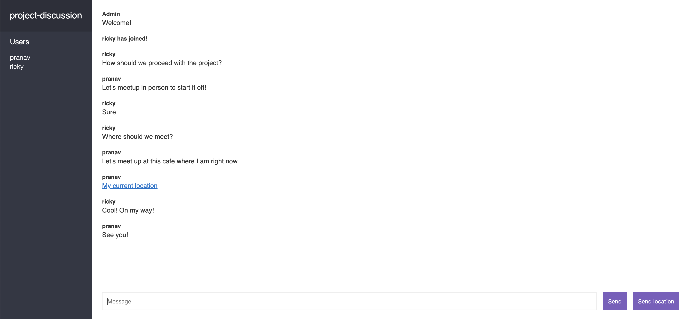

# Chatting-place

Chatting-Place is a simple web application allowing users to join rooms to send messages and their location.

## Installation

Use the package manager [npm](https://npmjs.com) to install dependencies

```bash
npm install
```

## Usage

```bash
npm run dev
```

# Example

